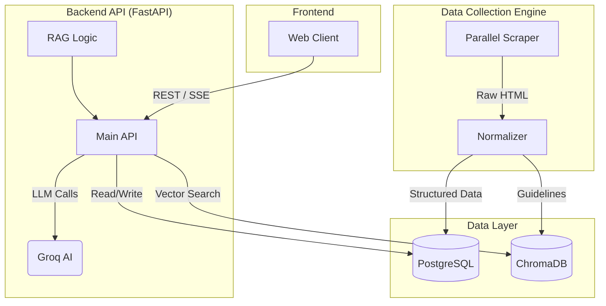

# DEB's Health Navigator: Comprehensive Project Guide

This document provides a detailed overview of the system architecture, workflows, data pipelines, and file structure of the DEB's Health Navigator project.

---

## 🏗️ System Architecture

The system follows a modern microservice-like architecture where the **Data Collection Engine (Scraper)** operates independently to populate the **Database Layer**, which is then consumed by the **FastAPI Backend** to serve the **Frontend**.

---

## 🔄 Core Workflows

### 1. Data Collection & Processing Pipeline
This workflow runs independently to ensure the system has the latest health data.

1.  **Initialization**: `src/scraper/main.py` initializes a `ThreadPoolExecutor` with `MAX_THREADS` (default 5).
2.  **Parallel Execution**: It launches individual scrapers for:
    *   **Sources**: WHO, CDC, ECDC, MoHFW, ICMR, NCDC, NHM, State Health Departments.
3.  **Scraping Strategy (`src/scraper/base_scraper.py`)**:
    *   Attempts fast HTTP requests using `requests.Session` with retries.
    *   **Fallback**: If a 404, 403, or specific error occurs, it upgrades to a **Playwright** browser instance to render JavaScript and bypass simple anti-bot protections.
4.  **Normalization (`src/scraper/normalizer.py`)**:
    *   **Disease Names**: Fuzzy matching against a standardized `TARGET_DISEASES` list (e.g., "Dengue Fever" matches "Dengue").
    *   **Dates**: Standardizes disparate date formats to `YYYY-MM-DD`.
    *   **Locations**: Maps state/district names to canonical versions.
5.  **Storage (`src/scraper/db.py`)**:
    *   **Structured Data** (Outbreaks, Trends, Disease Info) is upserted into **PostgreSQL** to prevent duplicates.
    *   **Unstructured Text** (Guidelines, Protocols) is chunked and embedded into **ChromaDB** for AI retrieval.

### 2. The RAG Workflow (Chatbot)
This is the core intelligence of the system, handling user health queries.

1.  **User Input**: User sends a message via the chat interface.
2.  **Intent Classification**:
    *   An LLM call (`src/api/rag_logic.py`) analyzes the query to determine if it is a `Medical_Query`, `Chitchat`, `Outbreak_News`, or `Clarification`.
    *   Entities (Disease Name, Region) are extracted.
3.  **Hybrid Retrieval**:
    *   **Vector Search**: Finds semantically similar documents in ChromaDB using `SentenceTransformer` embeddings.
    *   **Keyword Search**: Finds exact keyword matches using BM25.
    *   **Re-ranking**: Results are combined and re-ranked using **Reciprocal Rank Fusion (RRF)** to get the best context.
4.  **Context Assembly**:
    *   Retrieved guidelines + Recent Outbreak Data (from Postgres) + Chat History are combined.
5.  **Generation**: The context is sent to **Groq Llama-3**, which synthesizes a plain-language answer.
6.  **Streaming**: The response is streamed token-by-token to the frontend for a responsive UX.

### 3. Hyper-Local Outbreak Alerts
1.  **Geolocation**: The frontend requests the user's location.
2.  **Backend Query**: The backend queries the `outbreaks` table in PostgreSQL.
3.  **Distance Calculation**: It calculates the distance between the user and active outbreak centers.
4.  **Notification**: If a **High Severity** outbreak is within 50km, a persistent alert overlay is triggered on the user's screen.

---

## 🗄️ Database Schema

### PostgreSQL Key Tables
*   `diseases`: Core registry of monitored diseases (symptoms, mortality rate, etc.).
*   `outbreaks`: Real-time reports of cases (Location, Date, Count, Status).
*   `disease_guidelines`: Text-heavy medical protocols and advice.
*   `trends`: Historical data for graphing disease growth rates.
*   `education_resources`: Videos, blogs, and schemes.
*   `connect_cache_*`: Caches for external places API (Doctors, Hospitals).

### ChromaDB Collections
*   `health_guidelines`: Stores vector embeddings of `disease_guidelines` text for semantic search.

---

## 📂 File Directory & Purpose Guide

### `src/` (Source Code)

#### `src/api/` - Backend Logic
*   **`main.py`**: The entry point. Configures FastAPI, CORS, and static file serving.
*   **`rag_logic.py`**: **CRITICAL**. Contains the RAG pipeline, Intent Classification, and Hybrid Search logic.
*   **`routers/`**: Contains API route definitions.
    *   `alerts.py`: Endpoints for outbreak alerts.
    *   `education.py`: Endpoints for fetching resources and generating AI summaries.
    *   `reports.py`: Handling user-submitted reports.
    *   `maps.py`: GIS data for map visualizations.

#### `src/scraper/` - Data Collection
*   **`main.py`**: The script you run to start scraping.
*   **`base_scraper.py`**: The parent class for all scrapers. implementation of `requests` + `playwright` fallback.
*   **`db.py`**: Database abstraction layer. Handles all SQL queries and connection correlations.
*   **`normalizer.py`**: The "cleaning lady". Fixes messy data before storage.
*   **`scrapers/`**: Folder containing individual scraper files (e.g., `who_scraper.py`, `cdc_scraper.py`).

### `public/` (Frontend)

#### `public/assets/js/`
*   **`chatbot.js`**: Manages the chat interface, WebSocket/Stream connection, and voice synthesis.
*   **`education.js`**: Fetches resources, handles filtering, and calls the AI summary endpoint.
*   **`map.js`** (Assumed): Handles the Leaflet/Google Maps integration for visualization.

---

## 🚀 How Data Flows

1.  **Ingestion**: `Scrapers` -> `Normalizer` -> `PostgreSQL` & `ChromaDB`.
2.  **Query**: `Frontend` -> `FastAPI` -> `RAG Logic` -> `DB/Chroma` -> `LLM` -> `Frontend`.
3.  **Alerts**: `DB` -> `FastAPI` -> `Frontend` (Active Polling/On Load).
